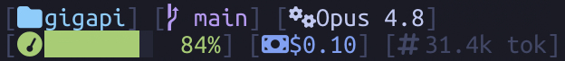

# claude-statusline

A simple, elegant status line for [Claude Code](https://docs.claude.com/en/docs/claude-code).



- **Line 1**: folder, git branch, model
- **Line 2**: context gauge (green → yellow → red as it fills), session cost, token count

Colors use the basic-16 ANSI palette so they remap to your terminal theme.

## Install

```sh
git clone https://github.com/therealparmesh/claude-statusline
cd claude-statusline
./install.sh
```

The installer copies `statusline.js` to `~/.claude/` and merges the `statusLine`
entry into your `settings.json`, leaving your other settings untouched.
Restart Claude Code to see it.

## Requirements

- [Bun](https://bun.sh)
- A [Nerd Font](https://nerdfonts.com) for the glyphs

## License

MIT
