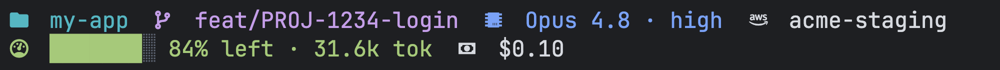

# claude-statusline

A two-line status line for [Claude Code](https://docs.claude.com/en/docs/claude-code).



The top line is where you are: the folder, the git branch, the model and its reasoning effort, and your cloud profile.

The bottom line is what the session has used: how much context is left, how many tokens are in it, and the cost so far. The context gauge turns yellow at 40% left and red at 20%.

You see a cloud profile only on Bedrock (your `AWS_PROFILE`) or Vertex (your project ID).

When the terminal is narrow, the parts that do not fit move down a line. Names longer than 24 characters are cut at a word boundary: the folder and branch keep their start, the cloud profile keeps its end (`…staging:ai-operator`).

The colors are the 16 basic ANSI colors, so they follow your terminal theme. The icons come from the Material Design Icons set in any Nerd Font.

## Install

You need [Bun](https://bun.sh), and a [Nerd Font](https://nerdfonts.com) for the icons.

```sh
git clone https://github.com/therealparmesh/claude-statusline
cd claude-statusline
./install.sh
```

The installer copies `statusline.js` into `~/.claude/` (or `$CLAUDE_CONFIG_DIR`) and points `statusLine` in `settings.json` at it. It does not touch your other settings. Restart Claude Code to see the status line.

## License

MIT
